<div class="cover-page">

<h1>Travaux Pratiques 1 : Initiation à Docker</h1>

<p class="cover-org"><strong>Institut Supérieur d'Informatique</strong></p>
<p class="cover-org"><strong>Département Génie des Télécommunications et Réseaux (GTR)</strong></p>

<p class="cover-meta"><strong>Module :</strong> Cloud Computing &amp; Virtualisation</p>
<p class="cover-meta"><strong>Groupes :</strong> M1 SSII</p>
<p class="cover-meta"><strong>Enseignant :</strong> Safa Réjichi</p>
<p class="cover-meta"><strong>Réalisé par :</strong> Talel Chaanbi</p>

</div>

## Objectifs

- Préparation et installation de Docker sur une MV « Ubuntu ».
- Manipuler des images Docker.
- Manipuler des conteneurs Docker.

---

## Partie 1 : Préparation de Docker et configurer le dépôt

### I. Création d'une machine virtuelle avec VirtualBox

#### 1. Téléchargement de VirtualBox

Rendez-vous sur le site de Oracle Virtual Box afin de télécharger la dernière version du logiciel :  
🔗 [https://www.virtualbox.org/wiki/Downloads](https://www.virtualbox.org/wiki/Downloads)

  
*Figure 1 : Page officielle de téléchargement de VirtualBox*

---

#### 2. Téléchargement d'Ubuntu

Rendez-vous sur le site de Ubuntu afin de télécharger la dernière version de l'OS :  
🔗 [https://ubuntu.com/download/desktop](https://ubuntu.com/download/desktop)

  
*Figure 2 : Page officielle de téléchargement d'Ubuntu Desktop*

  
*Figure 3 : Interface principale du logiciel VirtualBox*

---

#### 3. Création de la machine virtuelle

Créez la machine virtuelle appelée **Ubuntu** avec les paramètres suivants :

| Paramètre        | Valeur    |
|------------------|-----------|
| Nom de la machine | Ubuntu   |
| Mémoire RAM      | 3072 Mo   |
| Disque dur       | 30 Go     |

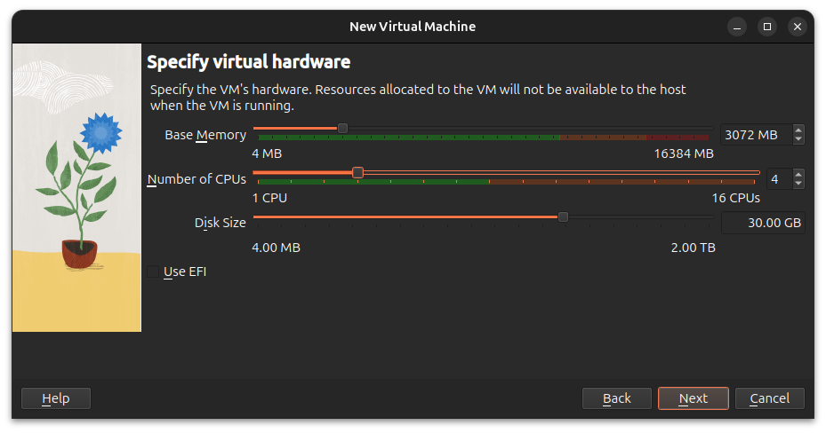  
*Figure 4 : Configuration de la machine virtuelle Ubuntu (RAM : 3072 Mo, Disque : 30 Go)*

---

### II. Installation de Docker

Il existe deux versions de Docker pour les systèmes Linux : **Docker CE** (Community Edition) et **Docker EE** (Enterprise Edition). La version CE est gratuite et open-source.

#### 1. Mise à jour de la liste des packages

```bash
sudo apt-get update
```

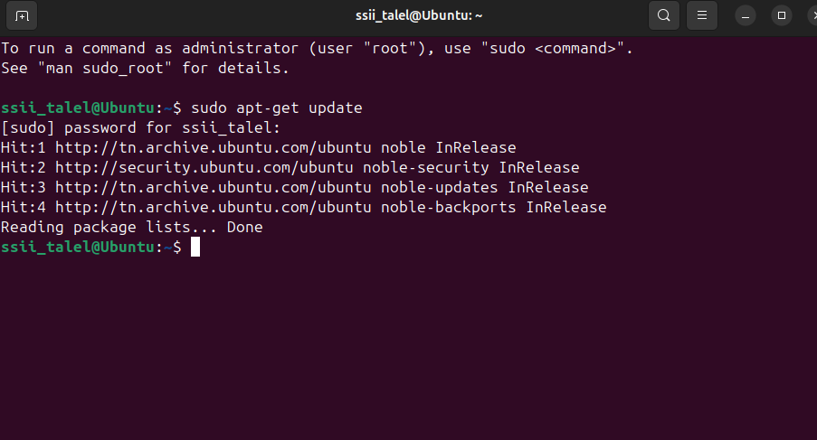  
*Figure 5 : Mise à jour de la liste des packages (`sudo apt-get update`)*

---

#### 2. Installation des paquets pré-requis

```bash
sudo apt-get install apt-transport-https ca-certificates curl software-properties-common
```

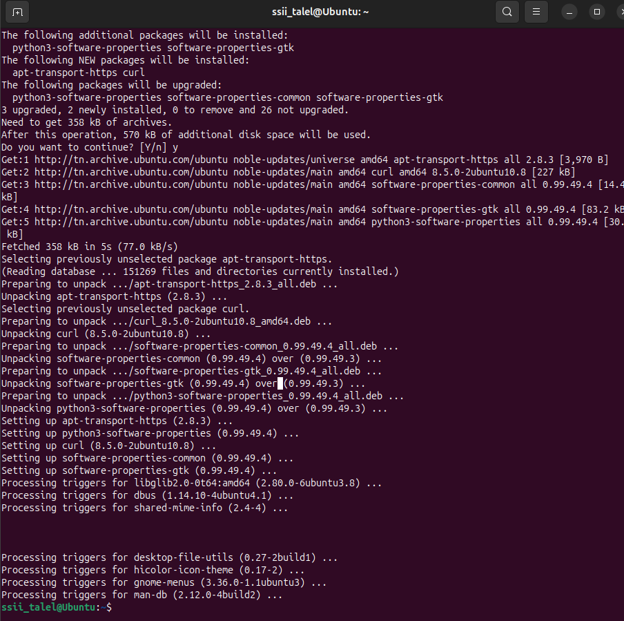  
*Figure 6 : Installation des dépendances nécessaires à Docker*

---

#### 3. Ajout de la clé GPG du dépôt Docker

```bash
curl -fsSL https://download.docker.com/linux/ubuntu/gpg | sudo gpg --dearmor -o /usr/share/keyrings/docker-archive-keyring.gpg
```

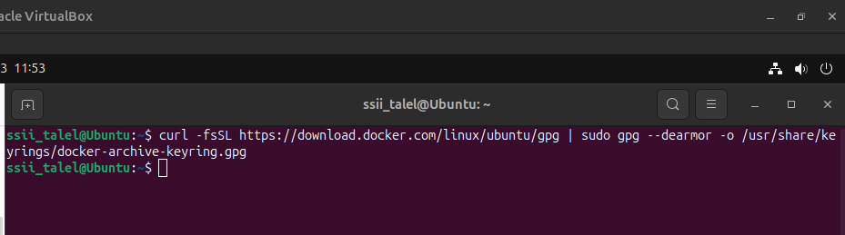  
*Figure 7 : Ajout de la clé GPG officielle du dépôt Docker*

---

#### 4. Configuration du dépôt stable Docker CE

```bash
echo "deb [arch=$(dpkg --print-architecture) signed-by=/usr/share/keyrings/docker-archive-keyring.gpg] https://download.docker.com/linux/ubuntu $(lsb_release -cs) stable" | sudo tee /etc/apt/sources.list.d/docker.list > /dev/null
```

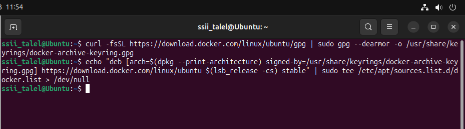  
*Figure 8 : Ajout du dépôt officiel Docker CE dans les sources APT*

---

## Partie 2 : Installer Docker CE

### I. Installation de Docker CE et les paquets nécessaires

#### 1. Mettre à jour l'index APT

```bash
sudo apt-get update
```
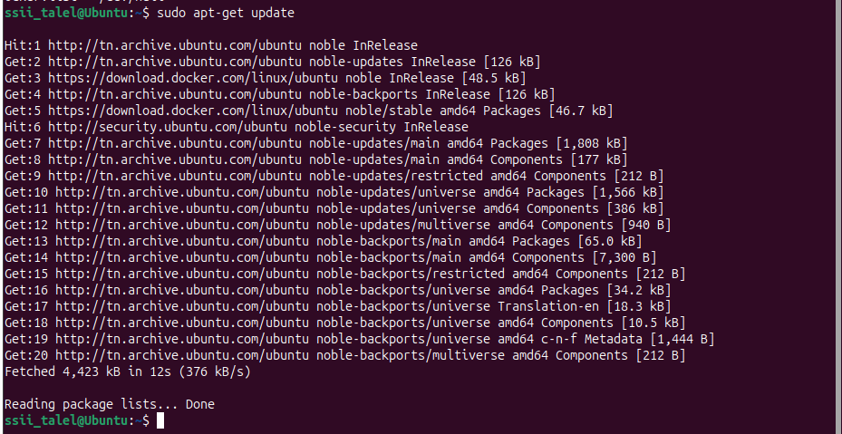
*Figure 9 : Résultat de `sudo apt-get update`*

---

#### 2. Installer la dernière version de Docker Engine et containerd

```bash
sudo apt-get install docker-ce docker-ce-cli containerd.io
```
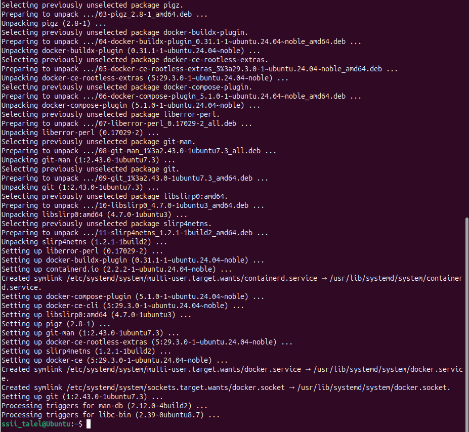
*Figure 10 : Installation de Docker Engine et des composants associés*

---

#### 3. Vérifier la version de Docker installée

```bash
sudo docker --version
```
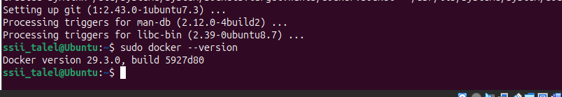
*Figure 11 : Vérification de la version de Docker installée*

---

### III. Autoriser l'utilisateur à utiliser Docker sans sudo

Par défaut, seul `root` peut lancer les commandes Docker. Voici comment autoriser votre compte utilisateur.

#### I. Créer le groupe docker (s'il n'existe pas)

```bash
sudo groupadd docker
```
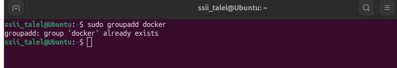
*Figure 12 : Création du groupe `docker`*

---

#### II. Ajouter l'utilisateur au groupe docker

```bash
sudo usermod -aG docker $USER
```
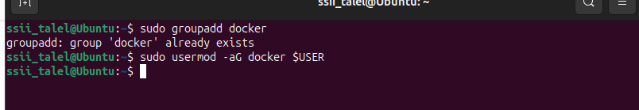
*Figure 13 : Ajout de l'utilisateur courant au groupe `docker`*

---

#### III. Redémarrer le système

```bash
reboot
```

---

#### IV. Vérifier que Docker fonctionne sans sudo

```bash
docker --version
```
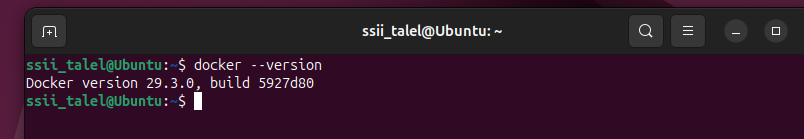
*Figure 14 : Vérification que Docker fonctionne sans sudo (`docker --version` sans sudo)*

---

#### V. Lancer le conteneur de test hello-world

```bash
docker run hello-world
```

**Interprétez le résultat obtenu :**

> ✏️ **Réponse :** La commande `docker run hello-world` permet de vérifier que Docker fonctionne correctement. L'image `hello-world` est téléchargée (si elle n'est pas déjà présente), puis exécutée dans un conteneur. Le message affiché confirme que l'installation de Docker est réussie et que le moteur Docker est opérationnel. Le conteneur affiche un message de bienvenue puis s'arrête automatiquement.

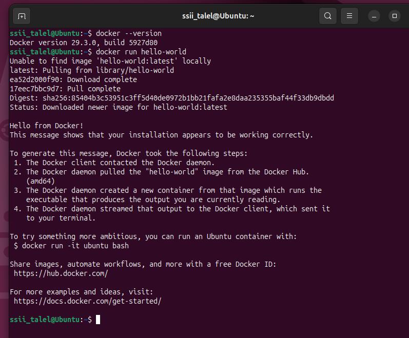
*Figure 15 : Message de succès après l'exécution du conteneur hello-world*

---

## Partie 3 : Manipulation d'images Docker

### I. Lister les images Docker

```bash
docker image ls
```

ou bien :

```bash
docker images
```
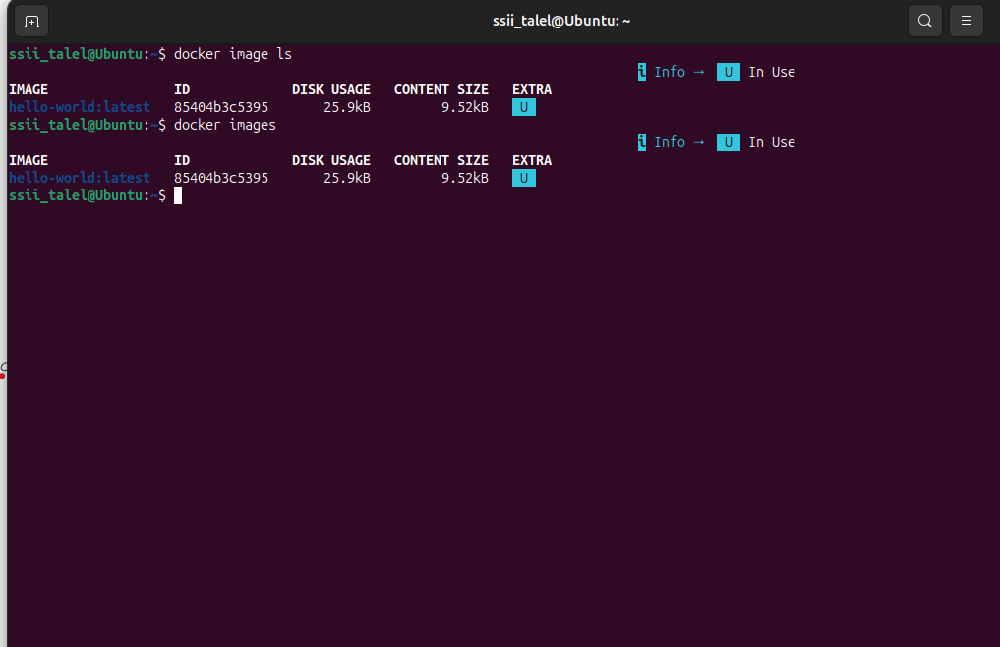
*Figure 16 : Résultat de `docker images` — liste des images locales*

---

### II. Supprimer une image Docker

#### 1. Supprimer une image par son ID ou son nom

Avec l'ID de l'image :

```bash
docker rmi <IMAGE ID>
```

Avec le nom de l'image :

```bash
docker rmi <nom de l'image>
```

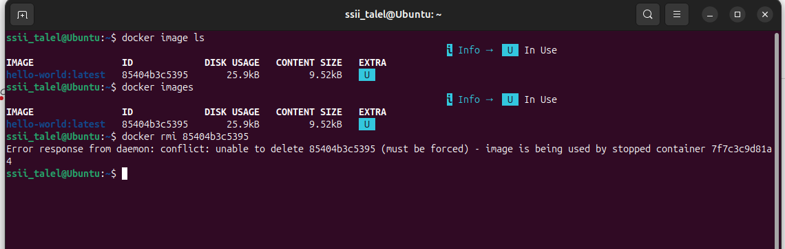
*Figure 17 : Message d'erreur lors de la tentative de suppression d'une image Docker*

---

#### 2. Message d'erreur — Explication

**Expliquez pourquoi vous obtenez un message d'erreur ?**

> ✏️ **Réponse :** Ce message d'erreur apparaît généralement lorsque l'image Docker que vous essayez de supprimer est utilisée par un ou plusieurs conteneurs (même arrêtés). Docker empêche la suppression d'une image tant qu'elle est référencée par un conteneur pour éviter les incohérences. Il faut d'abord supprimer ou détacher les conteneurs associés avant de pouvoir supprimer l'image.


---

#### 3. Forcer la suppression de l'image

```bash
docker rmi -f hello-world
```


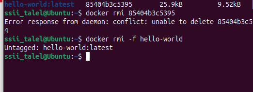
*Figure 18 : Résultat de la suppression forcée d'une image Docker (`docker rmi -f hello-world`)*

---

## Partie 4 : Manipulation de conteneurs Docker

### I. Créer un conteneur

#### 1. Créer une instance d'une image (créer un conteneur)

```bash
docker run ubuntu:latest
```
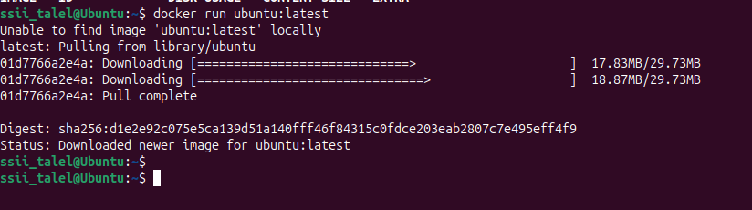
*Figure 19 : Création d'un conteneur Ubuntu*

---

#### 2. Lancer un conteneur Ubuntu interactif

```bash
docker run -ti ubuntu:latest
```

**Que remarquez-vous et pourquoi ?**

> ✏️ **Réponse :** *Le conteneur reste actif en mode interactif grâce à -ti. On peut travailler dans ce mini système Linux isolé.*

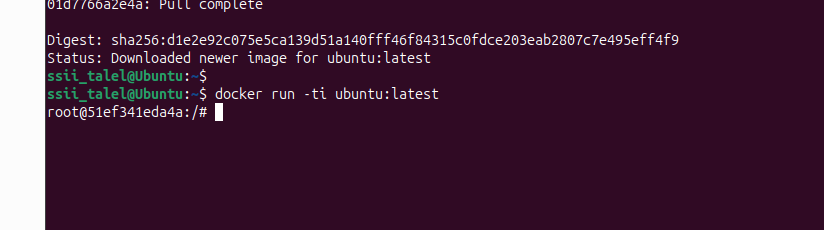
*Figure 20 : Lancement interactif d'un conteneur Ubuntu (`docker run -ti ubuntu:latest`)*

---

#### 3. Lancer la commande `ls` dans le conteneur

```bash
ls
```
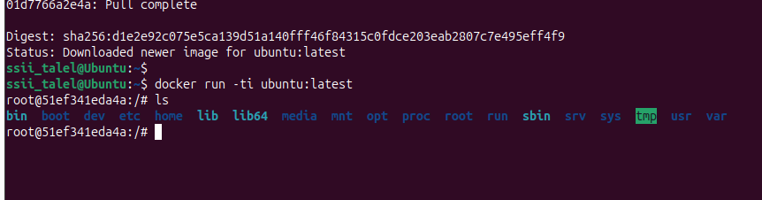
*Figure 21 : Résultat de la commande `ls` dans le conteneur*

---

#### 4. Lancer la commande `ip address`

```bash
ip address
```
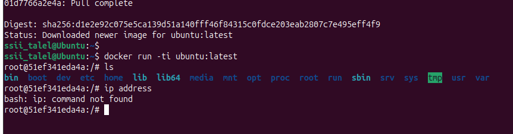
*Figure 22 : Résultat de `ip address` dans le conteneur*

---

#### 5. Que remarquez-vous ?

> ✏️ **Réponse :** *L’outil réseau (iproute2) n’est pas installé par défaut dans l’image Ubuntu minimale.*

---

#### 6. Installer `iproute2` et obtenir l'adresse IP du conteneur

```bash
apt-get update && apt-get install iproute2
```

Puis relancer :

```bash
ip address
```

**Donnez l'adresse IP de votre conteneur :**

> ✏️ **Réponse :** *eth0: inet 172.17.0.2/16*
 
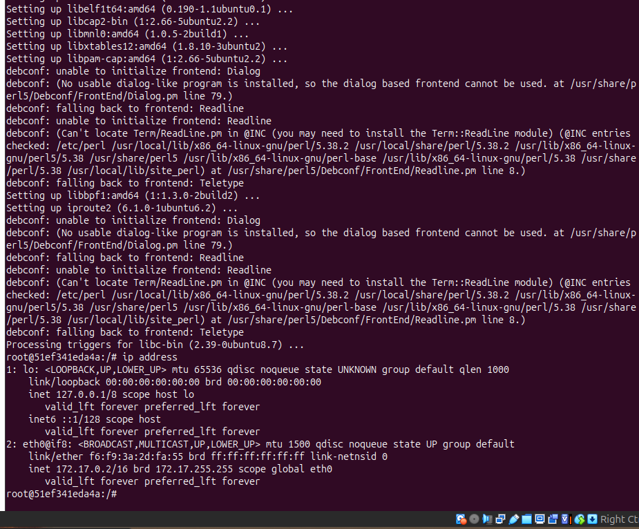
*Figure 23 : Adresse IP affichée pour le conteneur (ex. 172.17.0.2/16)*

---

### II. Utilité des conteneurs

#### 1. Détruire le conteneur Ubuntu

> ⚠️ **ATTENTION : Assurez-vous bien que vous êtes dans un conteneur avant de lancer cette commande !**

```bash
rm -rf /*
```
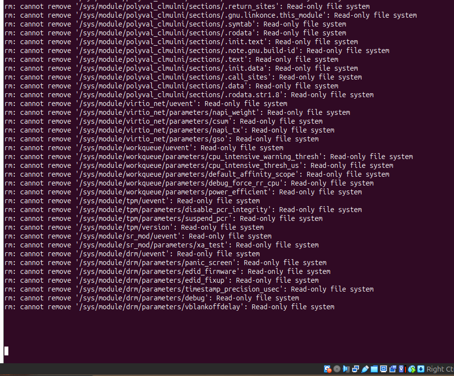
*Figure 24 : Suppression des fichiers dans le conteneur (`rm -rf /*`) — exemple d'effet*

---

#### 2. Vérifier la destruction

```bash
ls
```
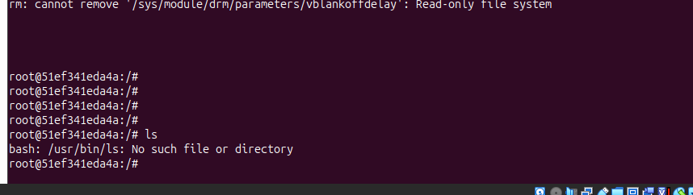
*Figure 25 : Vérification de la destruction via `ls`*

---

#### 3. Quitter le conteneur et en créer un nouveau nommé `conteneur_ubuntu`

```bash
exit
```

```bash
docker run -ti --name conteneur_ubuntu ubuntu:latest
```

---

#### 4. Relancer la commande `ls`

```bash
ls
```
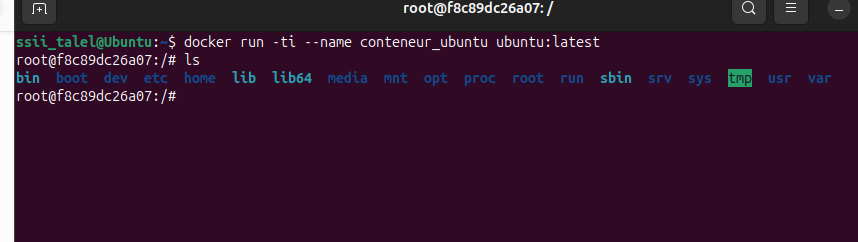
*Figure 26 : Résultat de `ls` dans le nouveau conteneur `conteneur_ubuntu`*

---

#### 5. Que remarquez-vous ?

> ✏️ **Réponse :** *Le nouveau conteneur est intact : les modifications apportées à l’ancien conteneur n’affectent pas le nouveau.*

---

#### 6. Lancer `ip address` dans le nouveau conteneur — Résultat et explication

```bash
ip address
```

**Qu'obtenez-vous et pourquoi ?**

> ✏️ **Réponse :** *On lance l'installation de iproute2 d'abord puis on exécute ip address. Chaque conteneur possède sa propre adresse IP et son réseau isolé.*

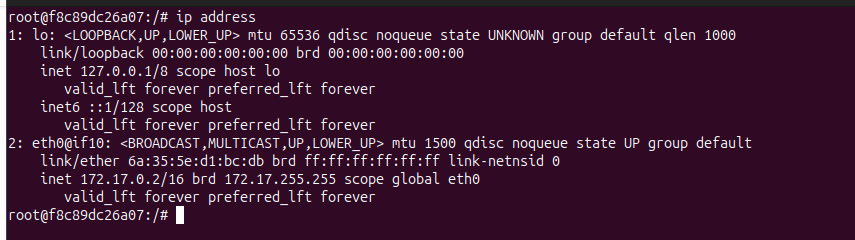
*Figure 27 : Résultat de `ip address` dans le nouveau conteneur*

---

#### 7. Quitter le conteneur sans le détruire

```
Ctrl + P + Q
```
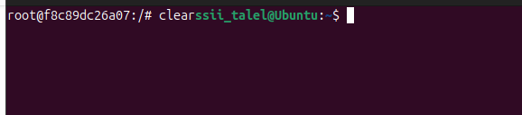
*Figure 28 : Illustration de la combinaison `Ctrl+P+Q` pour détacher du conteneur*

---

### III. Afficher la liste des conteneurs

```bash
docker container ls
```

ou :

```bash
docker ps
```
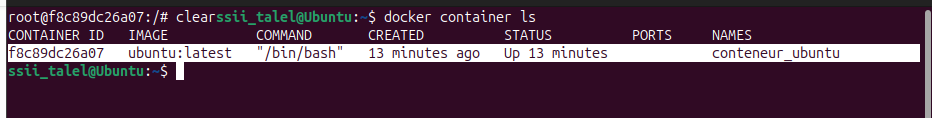
*Figure 29 : Résultat de `docker container ls` / `docker ps`*

---

### IV. Exécuter un shell dans le conteneur

```bash
docker exec -ti conteneur_ubuntu bash
```
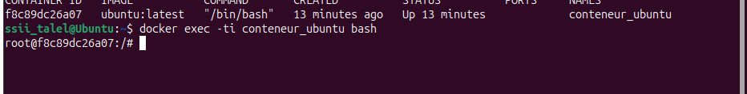
*Figure 30 : Exécution d'un shell dans le conteneur (`docker exec -ti conteneur_ubuntu bash`)*

---

### V. Transformer un conteneur en image

#### 1. Installer `iproute2` (net-tools)

```bash
apt-get update && apt-get install iproute2
```

---

#### 2. Créer un fichier de test

```bash
echo "ceci est un fichier qui contient des donnes de test" > test.txt && cat test.txt
```
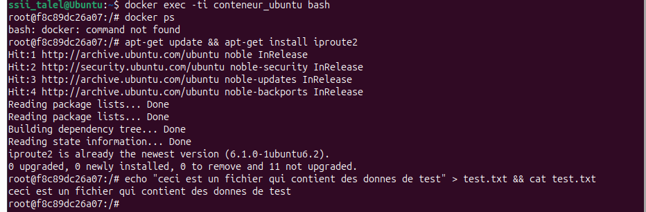
*Figure 31 : Création et affichage du fichier `test.txt` dans le conteneur*

---

#### 3. Quitter le conteneur sans le détruire

```
exit
```

---

#### 4. Transformer le conteneur en image nommée `image_m1ssii`

```bash
docker commit <CONTAINER NAME or ID> image_m1ssii
```
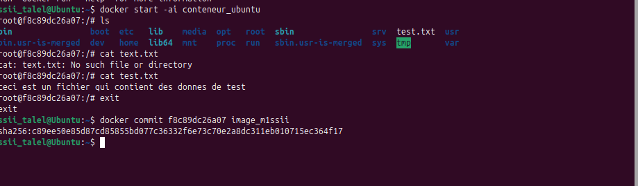
*Figure 32 : Résultat de la commande `docker commit` — création de `image_m1ssii`*

---

#### 5. Vérifier la nouvelle image

```bash
docker images
```
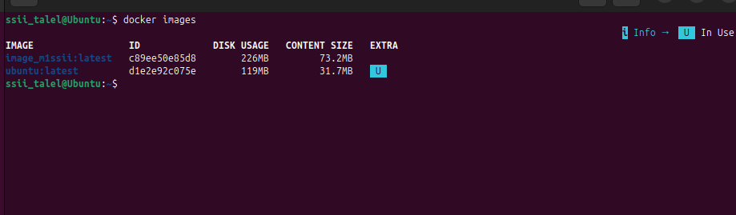
*Figure 33 : Affichage de `docker images` montrant `image_m1ssii`*

---

#### 6. Relancer un nouveau conteneur nommé `conteneur_m1ssii` basé sur la nouvelle image

```bash
docker run -ti --name conteneur_m1ssii image_m1ssii
```

---

#### 7. Vérifier si les données ont bien été stockées

**Vérifiez si le fichier `test.txt` est présent dans ce nouveau conteneur :**

> ✏️ **Réponse :** *Les données ont été conservées dans la nouvelle image et sont présentes dans le conteneur créé à partir de cette image.*

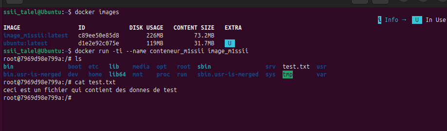
*Figure 34 : Vérification que `test.txt` est présent dans le conteneur créé à partir de `image_m1ssii`*

---

### VI. Supprimer un conteneur

```bash
docker rm <CONTAINER NAME ou ID>
```

**Vérifiez que le conteneur a bien été supprimé :**

```bash
docker ps -a
```
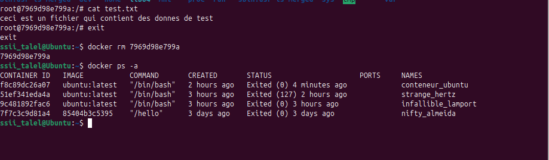
*Figure 35 : Affichage de `docker ps -a` confirmant la suppression du conteneur*

---

*Fin du TP 1 — Initiation à Docker*
