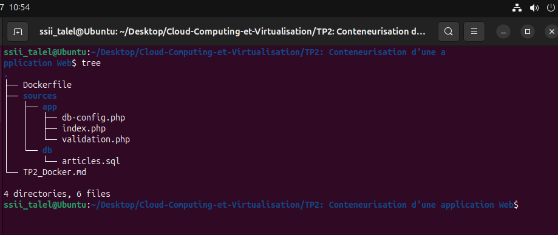
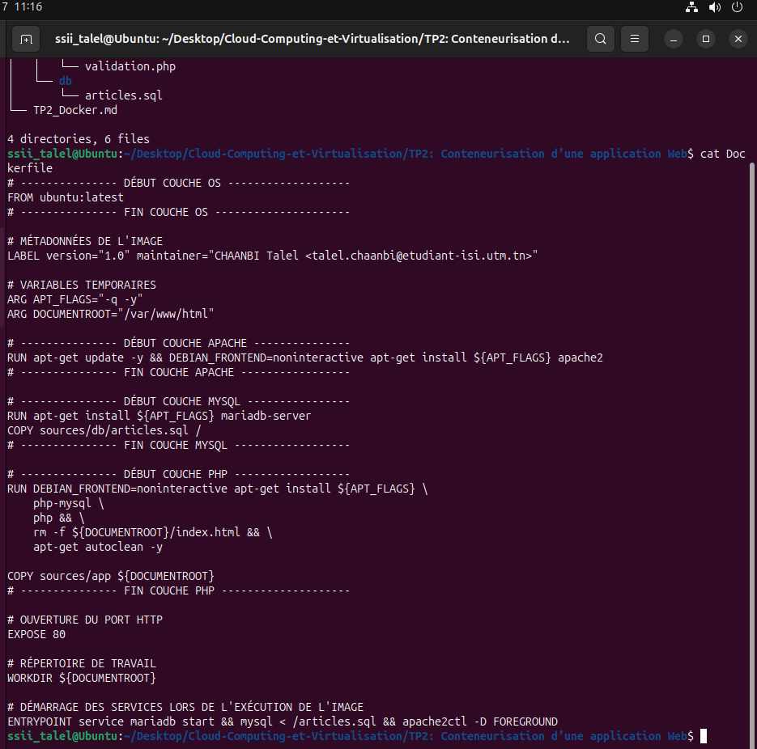
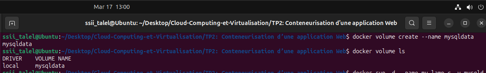
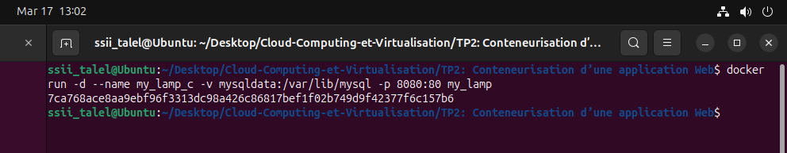
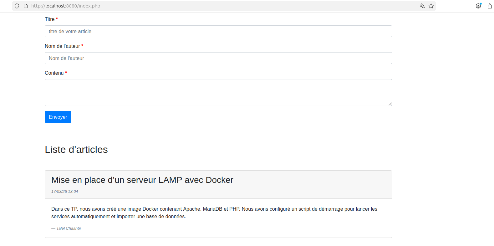
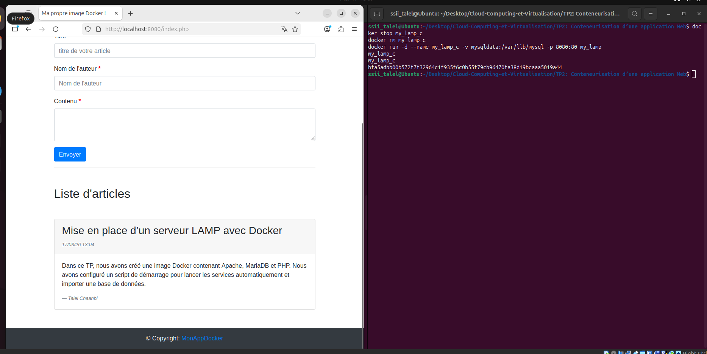
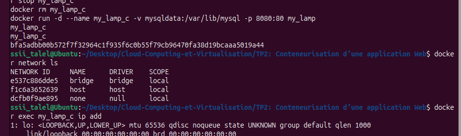
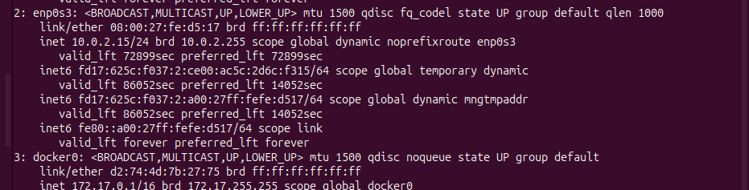
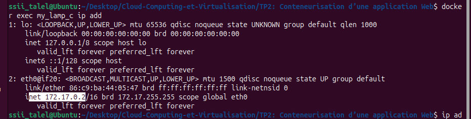
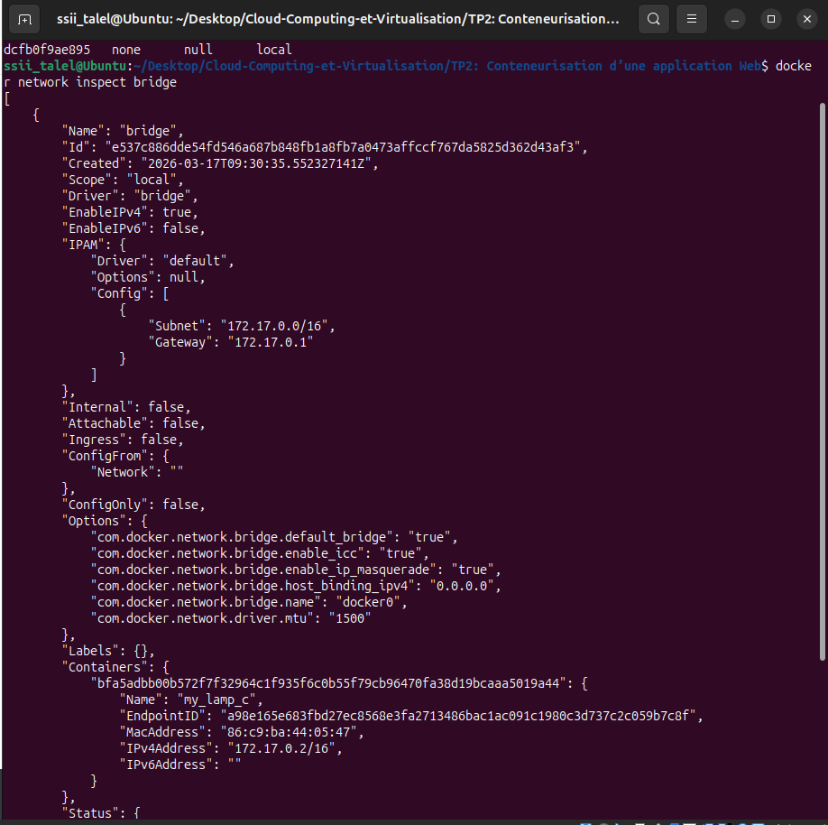

# Travaux Pratiques 2 : Conteneurisation d’une application Web

**Institut Supérieur d'Informatique**  
**Département Génie des Télécommunications et Réseaux (GTR)**

**Module :** Cloud Computing & Virtualisation  
**Groupes :** M1 SSII  
**Enseignant :** Safa Réjichi  
**Mail :** talel.chaanbi@etudiant-isi.utm.tn  
**Réalisé par :** Talel Chaanbi

## Objectifs

- Création d’une stack LAMP au moyen de Docker.
- Manipulation de Dockerfile.
- Manipulation de volumes.
- Appréhension de la notion de réseau avec Docker.

---

## Partie 1 : Manipulation de Dockerfile

### I. Préparation du répertoire de travail

1. Ouvrez la machine virtuelle et créez un répertoire de travail.
2. Désarchivez le contenu fourni, avec l’arborescence suivante :

```text
sources/
├── app/
│   ├── db-config.php
│   ├── index.php
│   └── validation.php
└── db/
    └── articles.sql
```

3. Créez un fichier `Dockerfile` à la racine du projet.


*Figure 1 : Arborescence du projet TP2 (sources/app, sources/db, Dockerfile)*

---

### II. Création de l’image LAMP

#### 1. Dockerfile utilisé

```dockerfile
# --------------- DÉBUT COUCHE OS -------------------
FROM ubuntu:latest
# --------------- FIN COUCHE OS ---------------------

# MÉTADONNÉES DE L'IMAGE
LABEL version="1.0" maintainer="CHAANBI Talel <talel.chaanbi@etudiant-isi.utm.tn>"

# VARIABLES TEMPORAIRES
ARG APT_FLAGS="-q -y"
ARG DOCUMENTROOT="/var/www/html"

# --------------- DÉBUT COUCHE APACHE ---------------
RUN apt-get update -y && DEBIAN_FRONTEND=noninteractive apt-get install ${APT_FLAGS} apache2
# --------------- FIN COUCHE APACHE -----------------

# --------------- DÉBUT COUCHE MYSQL ----------------
RUN apt-get install ${APT_FLAGS} mariadb-server
COPY sources/db/articles.sql /
# --------------- FIN COUCHE MYSQL ------------------

# --------------- DÉBUT COUCHE PHP ------------------
RUN DEBIAN_FRONTEND=noninteractive apt-get install ${APT_FLAGS} \
    php-mysql \
    php && \
    rm -f ${DOCUMENTROOT}/index.html && \
    apt-get autoclean -y

COPY sources/app ${DOCUMENTROOT}
# --------------- FIN COUCHE PHP --------------------

# OUVERTURE DU PORT HTTP
EXPOSE 80

# RÉPERTOIRE DE TRAVAIL
WORKDIR ${DOCUMENTROOT}

# DÉMARRAGE DES SERVICES LORS DE L'EXÉCUTION DE L'IMAGE
ENTRYPOINT service mariadb start && mysql < /articles.sql && apache2ctl -D FOREGROUND
```

**Expliquez le contenu du Dockerfile :**

> ✏️ **Réponse :**
>
> - `FROM ubuntu:latest` : image de base Ubuntu.
> - Installation d’Apache (`apache2`) pour le serveur Web.
> - Installation de MariaDB pour la base de données.
> - Copie du script SQL `articles.sql`.
> - Installation de PHP + extension `php-mysql`.
> - Copie de l’application PHP vers `/var/www/html`.
> - Exposition du port `80`.
> - Démarrage MariaDB + import SQL + lancement Apache au démarrage du conteneur.


*Figure 2 : Contenu du Dockerfile de la stack LAMP*

---

#### 2. Build de l’image

```bash
docker build -t my_lamp .
```

```bash
docker images
```

*Figure 3 : Construction de l’image `my_lamp` et vérification via `docker images`*

---

### III. Création et exécution du conteneur

1. Lancer le conteneur :

```bash
docker run -d --name my_lamp_c -p 8080:80 my_lamp
```

2. **Expliquez l’option `-p 8080:80` :**

> ✏️ **Réponse :** le port `8080` de la machine hôte est redirigé vers le port `80` du conteneur (serveur Apache).

3. Donner les droits nécessaires :

```bash
docker exec my_lamp_c chmod 777 /var/www/html/index.php
docker exec my_lamp_c chmod 777 /var/www/html/db-config.php
docker exec my_lamp_c chmod 777 /var/www/html/validation.php
```

4. Vérifier l’état du conteneur :

```bash
docker ps
```

5. En cas de problème, consulter les logs :

```bash
docker logs -ft my_lamp_c
```

6. Tester l’application :

- URL : `http://localhost:8080/`


*Figure 4 : Lancement du conteneur `my_lamp_c` et vérification du statut*


*Figure 5 : Affichage de l’application sur `http://localhost:8080/`*

---

### IV. Test de persistance sans volume

1. Ajouter un nouvel article depuis l’interface.


*Figure 6 : Ajout d’un nouvel article via l’interface*

2. Détruire puis recréer le conteneur :

```bash
docker stop my_lamp_c
docker rm my_lamp_c
docker run -d --name my_lamp_c -p 8080:80 my_lamp
docker exec my_lamp_c chmod 777 -R /var/www/html
```


*Figure 7 : Suppression et recréation du conteneur (exécution des commandes)*

3. Vérifier l’existence de l’article déjà ajouté.

**Expliquez le résultat :**

> ✏️ **Réponse :** l’article est perdu, car les données de la base étaient stockées dans le conteneur supprimé (pas de volume persistant).


*Figure 8 : Perte des données après suppression/recréation du conteneur sans volume (Liste vide)*

---

## Partie 2 : Manipulation de Volume

### I. Création et utilisation d’un volume Docker

1. Créer le volume :

```bash
docker volume create --name mysqldata
```

2. Lister les volumes :

```bash
docker volume ls
```

*Figure 9 : Liste des volumes Docker (`docker volume ls`)*

3. Exécuter le conteneur avec le volume :

```bash
docker run -d --name my_lamp_c -v mysqldata:/var/lib/mysql -p 8080:80 my_lamp
```

*Figure 10 : Exécution du conteneur avec le volume `mysqldata` monté*

4. **Expliquez l’option `-v mysqldata:/var/lib/mysql` :**

> ✏️ **Réponse :** le volume Docker `mysqldata` est monté dans `/var/lib/mysql` du conteneur, ce qui rend les données MariaDB persistantes.


---

### II. Vérification de la persistance avec volume

1. Ajouter un article via `http://localhost:8080/`.

*Figure 11 : Ajout d’un article via l’application (avec volume monté)*
2. Détruire puis recréer le conteneur avec le même volume :

```bash
docker stop my_lamp_c
docker rm my_lamp_c
docker run -d --name my_lamp_c -v mysqldata:/var/lib/mysql -p 8080:80 my_lamp
```

3. Vérifier l’existence de l’article ajouté.

**Expliquez le résultat :**

> ✏️ **Réponse :** l’article est conservé, car la base de données est stockée dans le volume `mysqldata`, indépendant du cycle de vie du conteneur.


*Figure 12 : Données conservées après recréation du conteneur grâce au volume*

---

## Partie 3 : Manipulation du Réseau

### I. Vérification du réseau Docker

1. Lister les réseaux Docker :

```bash
docker network ls
```

*Figure 13 : Liste des réseaux Docker (`docker network ls`)*

2. Donner l’adresse IP de la machine hôte.

*Figure 14 : Adresse IP de la machine hôte (extrait)*
3. Afficher l’adresse IP du conteneur :

```bash
docker exec my_lamp_c ip add
```


*Figure 15 : Adresse IP du conteneur `my_lamp_c` sur le réseau bridge*

4. Vérifier qu’ils sont sur le même réseau bridge.

*Figure 16 : Vérification du réseau bridge et correspondance des subnets*
> ✏️ **Réponse :** le conteneur est attaché au réseau bridge Docker (interface `docker0` côté hôte) et reçoit une IP privée de ce sous-réseau.


---

## Partie 4 : Publier son image dans Docker Hub

### I. Connexion et préparation

1. Créer un repository public sur `https://hub.docker.com/`.
2. Se connecter depuis le terminal :

```bash
docker login
```

*Figure 17 : Connexion au compte Docker Hub (`docker login`)*

3. Vérifier la présence de l’image locale :

```bash
docker images
```

*Figure 18 : Vérification de la présence de l’image locale (`docker images`)*


4. Tagger l’image :

```bash
docker tag my_lamp talelchaanbi/my_lamp:first
```

5. Vérifier le tag :

```bash
docker images
```


*Figure 19 : Tag de l’image et vérification dans la liste des images*

---

### II. Publication

```bash
docker push talelchaanbi/my_lamp:first
```


*Figure 20 : Exécution de la commande `docker push` vers Docker Hub*

**Vérification :**

> ✏️ **Réponse :** l’image est visible dans le repository Docker Hub après le `push`.


*Figure 21 : Image `my_lamp` publiée et visible sur Docker Hub*

---

## Bonnes pratiques de sécurité (TP2)

1. Éviter de travailler en root permanent.
2. Limiter l’usage du groupe `docker` (droits équivalents root).
3. Ne pas utiliser `--privileged` sans besoin réel.
4. Exposer uniquement les ports nécessaires.
5. Utiliser des volumes pour les données critiques.
6. Vérifier les images avant usage et les mettre à jour.
7. Sauvegarder régulièrement les volumes et journaliser les actions.

---

*Fin du TP 2 — Conteneurisation d’une application Web*


## Modifications apportées au TP


*Figure 22 : Capture d’écran montrant le problème détecté lors du démarrage (import SQL échoué)*

Pour améliorer la robustesse et la maintenabilité de la stack LAMP fournie, nous avons apporté les modifications suivantes :

- Ajout du script de démarrage `start.sh` (présent à la racine du TP). Ce script : démarre MariaDB, importe la base `articles.sql` une seule fois (repère via le fichier `/var/lib/mysql/.db_initialized`) puis lance Apache en avant-plan.

- Mise à jour du `Dockerfile` pour copier `start.sh` dans l'image et utiliser `ENTRYPOINT ["/start.sh"]` au lieu d'une commande inline. Cela permet une meilleure gestion des signaux et un démarrage plus clair des services.

Motifs : fiabilité du démarrage (éviter les erreurs d'import SQL causées par MariaDB non initialisé), éviter un ré-import à chaque redémarrage, et respecter les bonnes pratiques Docker (script de démarrage exécutable, `ENTRYPOINT` en forme JSON).

Captures :


*Figure 23 : Contenu du script `start.sh` ajouté*


*Figure 24 : Extrait du `Dockerfile` montrant la copie et l'ENTRYPOINT*


*Figure 25 : Exemple de sortie de `docker build` / `docker run` montrant l'image `my_lamp` démarrée*


